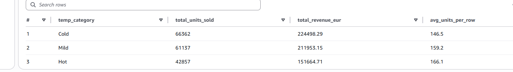
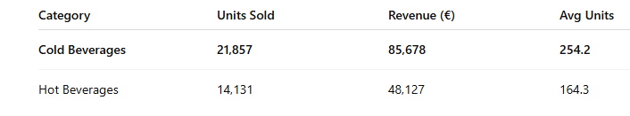
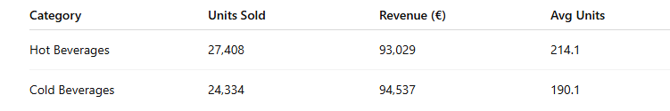

# ANALYSIS BASED ON SALES PERFORMANCE IN RELATION TO TEMPRATURE CATEGORY-----------------

### Total demand (volume)
Cold days have the highest total units sold
Hot days have the lowest total units sold

---- means overall café traffic is higher in colder weather----

### Revenue follows the same pattern

Cold → €224k
Mild → €212k
Hot → €152k

----Customers spend more overall during cold periods----

BUT: Average units per transaction increases with temperature

Cold → 146.5
Mild → 159.2
Hot → 166.1 (highest)

----- On hot days: Fewer transactions  But each transaction is larger on average---

Cold weather increases store traffic and total demand, while hot weather reduces traffic but encourages higher per-visit consumption, likely driven by cold beverages.##

## ANALYSIS BASED ON PRODUCT CATEGORY IN RELATION TO TEMPERATURE CATEGORY------------------
A. COLD WEATHER(≤ 10°C)

Hot beverages dominate cold conditions.
Nearly 3× more units sold than cold beverages.

---Customers strongly prefer warming drinks in cold weather.----

## Business intepration

Cold months = prioritize coffee, tea, hot chocolate
Cold beverages should be stocked minimally

B.HOT WEATHER(≥ 20°C)

Interpretation
Demand flips in hot weather.
Cold beverages outsell hot beverages by ~55%.
Revenue follows the same direction.

# Business interpration

Summer = cold drinks drive revenue
Hot beverages lose relevance

C. MLD WEATHER (10–20°C)

Interpretation
Demand is balanced
Slight unit advantage for hot beverages
Slight revenue advantage for cold beverages

# Business interpration

Transitional seasons require balanced inventory